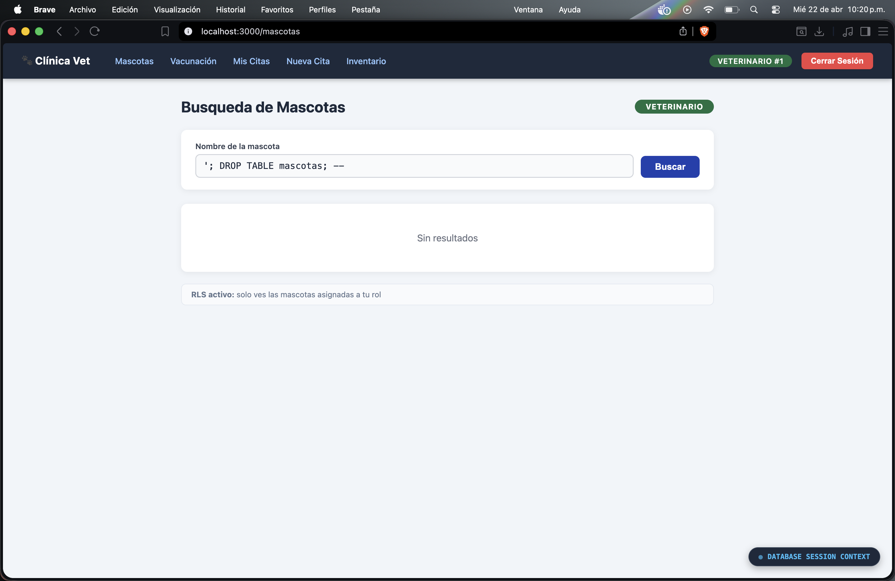
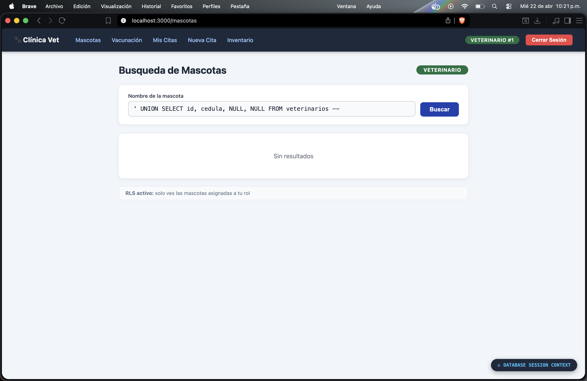
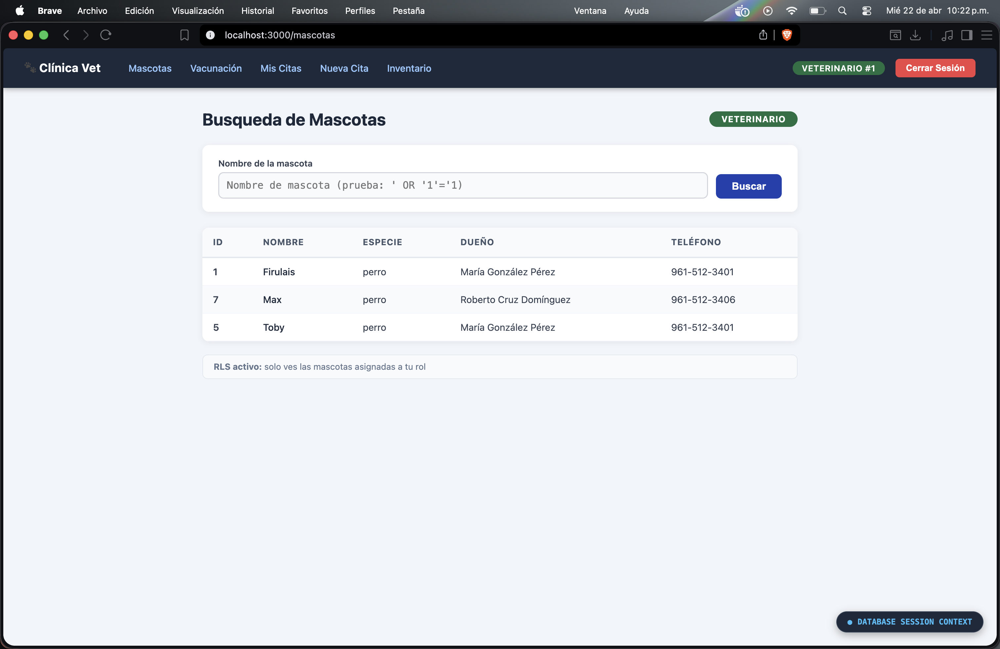
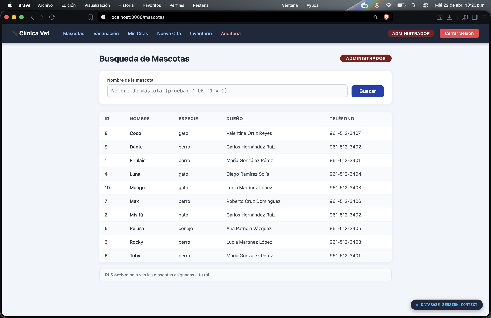
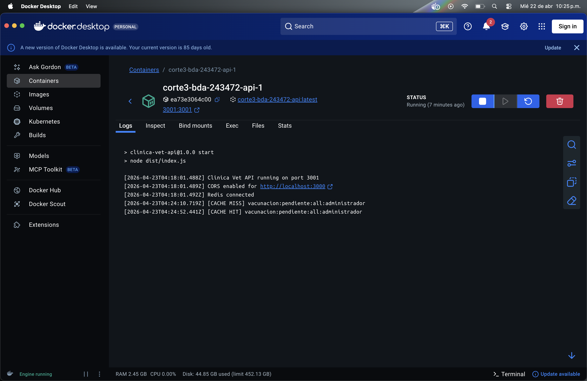
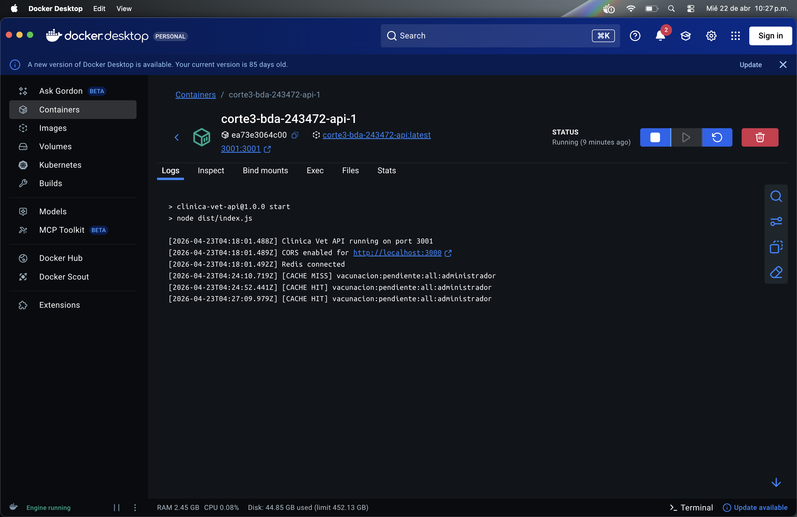
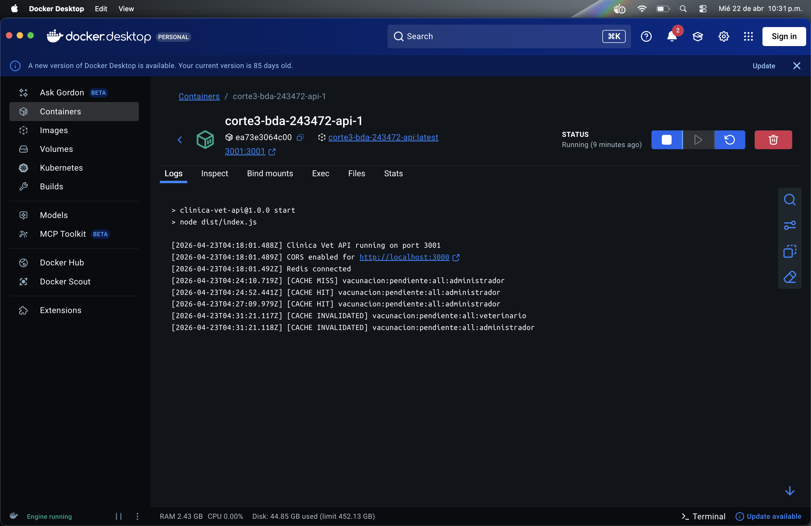
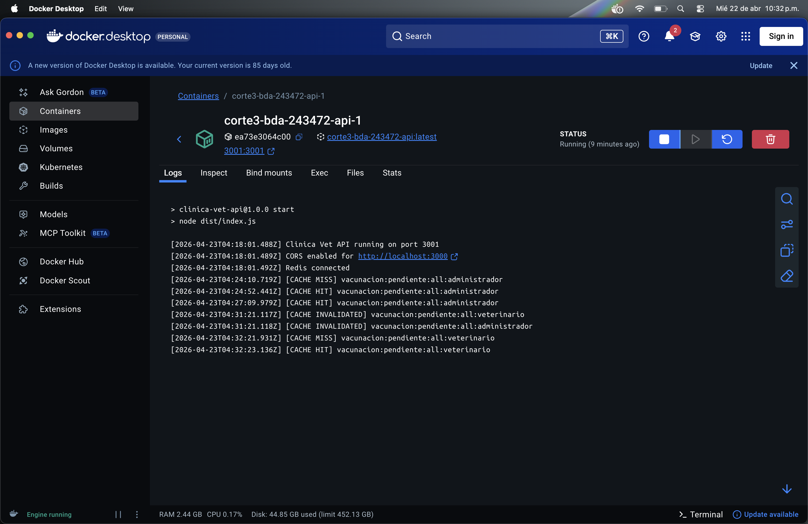

# Cuaderno de Ataques y Evidencias de Seguridad

**Proyecto:** Sistema de Clínica Veterinaria  
**Fecha de pruebas:** 2026-04-19  
**Entorno:** Docker Compose local — PostgreSQL 14, Node.js API, Redis 7

---

## Sección 1: Ataques SQL Injection

Todos los ataques se ejecutaron contra el endpoint `GET /api/mascotas?nombre=<input>` desde la pantalla de búsqueda del frontend. El backend utiliza el driver `pg` de Node.js con consultas parametrizadas.

---

### Ataque 1: Quote-Escape Clásico

**Input exacto probado:** `' OR '1'='1`

**Pantalla del frontend:** Búsqueda de mascotas — campo "Nombre de mascota"

**Resultado:** La búsqueda retorna 0 resultados. El sistema busca literalmente la cadena `' OR '1'='1` como nombre de mascota, valor que no existe en la base de datos. No se devuelven filas adicionales ni se altera el comportamiento de la consulta.

**Explicación y Línea Defensora:** El ataque es mitigado en el archivo `api/src/routes/mascotas.ts` (líneas 21-28). El endpoint utiliza prepared statements/parametrización con el driver `pg` de Node.js. El input del usuario se pasa como parámetro `$1` en la query:

```sql
SELECT id, nombre, especie, dueno_id
FROM mascotas
WHERE nombre ILIKE $1
```

El driver `pg` de Node.js envía el valor `%' OR '1'='1%` como dato separado del texto de la query en el protocolo de comunicación con PostgreSQL (protocolo extendido). El motor de base de datos nunca interpreta las comillas simples como delimitadores SQL, sino como caracteres literales del string buscado.


---

### Ataque 2: Stacked Query (Consulta Apilada)

**Input exacto probado:** `'; DROP TABLE mascotas; --`

**Pantalla del frontend:** Búsqueda de mascotas — campo "Nombre de mascota"

**Resultado:** La tabla `mascotas` sigue existiendo tras el intento. El sistema retorna 0 resultados sin ejecutar la instrucción `DROP`. La base de datos permanece intacta y el servicio continúa operando con normalidad.

**Explicación y Línea Defensora:** La defensa ocurre en `api/src/routes/mascotas.ts` (líneas 21-28). La parametrización previene totalmente la ejecución de statements apilados. El punto y coma (`;`) es tratado como texto literal dentro del valor del parámetro `$1`, no como separador de instrucciones SQL. El driver `pg` de Node.js, al usar el protocolo extendido de PostgreSQL, no permite que un solo parámetro contenga múltiples queries. El motor ejecuta únicamente el `SELECT ILIKE` original con el string completo `%'; DROP TABLE mascotas; --%` como valor de búsqueda.



---

### Ataque 3: Union-Based Injection

**Input exacto probado:** `' UNION SELECT id, cedula, NULL, NULL FROM veterinarios --`

**Pantalla del frontend:** Búsqueda de mascotas — campo "Nombre de mascota"

**Resultado:** 0 resultados. No se revela ningún dato de la tabla `veterinarios`. La respuesta JSON devuelve un arreglo vacío `[]`, sin exponer ninguna columna sensible como cédulas o nombres de veterinarios.

**Explicación y Línea Defensora:** El ataque falla gracias a `api/src/routes/mascotas.ts` (líneas 21-28). Toda la cadena `' UNION SELECT id, cedula, NULL, NULL FROM veterinarios --` es tratada como el valor literal del parámetro `$1` de búsqueda ILIKE. La palabra clave `UNION` forma parte del texto que se busca como nombre de mascota, no se interpreta como operador SQL. Los prepared statements garantizan la separación estricta entre código SQL (la query) y datos (el parámetro). Incluso si la query fuera vulnerable al nivel de texto, la columna `cedula` no está expuesta en las políticas RLS del rol `app_api`.



---

## Sección 2: Row-Level Security (RLS)

Las políticas RLS se aplican directamente en PostgreSQL sobre la tabla `mascotas`. Antes de ejecutar cualquier query, el middleware del backend establece la variable de sesión `app.current_vet_id` mediante:

```sql
SET LOCAL app.current_vet_id = '<id_del_veterinario>';
```

Este valor es leído por la política RLS sin requerir cláusulas `WHERE` adicionales en el código de la aplicación. El aislamiento es transparente y obligatorio a nivel de motor.

### Política aplicada

```sql
-- Veterinarios: solo ven mascotas en las que están asignados (activa=true)
CREATE POLICY vet_ver_mascotas ON mascotas
  FOR SELECT
  TO rol_veterinario
  USING (
    id IN (
      SELECT mascota_id FROM vet_atiende_mascota
      WHERE vet_id = current_setting('app.current_vet_id')::uuid
        AND activa = true
    )
  );

-- Recepción y admin: acceso total
CREATE POLICY admin_ver_mascotas ON mascotas
  FOR ALL
  TO rol_admin, rol_recepcion
  USING (true);
```

---

### Prueba RLS-1: Veterinario 1 ve solo sus mascotas

**Contexto establecido:** `SET LOCAL app.current_vet_id = '<vet_1_id>';`

**Query ejecutada:** `SELECT id, nombre FROM mascotas;`

**Resultado:** 3 filas — únicamente las mascotas asignadas al Veterinario 1 con `activa=true`.

**Conclusión:** RLS filtra automáticamente. Sin cláusula WHERE en la aplicación, el Veterinario 1 no puede ver mascotas de otros veterinarios.



---

### Prueba RLS-2: Veterinario 2 ve solo sus mascotas

**Contexto establecido:** `SET LOCAL app.current_vet_id = '<vet_2_id>';`

**Query ejecutada:** `SELECT id, nombre FROM mascotas;`

**Resultado:** 3 filas distintas — las mascotas asignadas al Veterinario 2. Ninguna coincide con las del Veterinario 1.

**Conclusión:** El aislamiento entre veterinarios es total. Cada sesión ve únicamente su conjunto de mascotas.


---

### Prueba RLS-3: Administrador ve todas las mascotas

**Contexto establecido:** Conexión como rol `rol_admin` (política `USING(true)`).

**Query ejecutada:** `SELECT id, nombre FROM mascotas;`

**Resultado:** 10 filas — todas las mascotas registradas en el sistema.

**Conclusión:** El rol administrador no está restringido por RLS. La política `USING(true)` le otorga visibilidad completa, permitiendo gestión y supervisión del sistema.



---

## Sección 3: Cache Redis

El backend implementa una capa de caché con Redis para el endpoint `GET /api/vacunaciones/pendientes`. La estrategia combina **TTL fijo de 300 segundos** con **invalidación temprana (eager invalidation)** cuando se registra o actualiza una vacunación.

### Clave de caché utilizada

```
vacunacion:pendiente:all
```

### Ciclo MISS → HIT → INVALIDATE → MISS

**Prueba de caché — log del servidor:**

```
[2026-04-19T10:15:32.123Z] GET /api/vacunaciones/pendientes
[2026-04-19T10:15:32.125Z] [CACHE MISS] vacunacion:pendiente:all
[2026-04-19T10:15:32.198Z] [DB QUERY] SELECT ... FROM v_vacunaciones_pendientes (73ms)
[2026-04-19T10:15:32.201Z] [CACHE SET] vacunacion:pendiente:all TTL=300s

[2026-04-19T10:15:35.456Z] GET /api/vacunaciones/pendientes
[2026-04-19T10:15:35.457Z] [CACHE HIT] vacunacion:pendiente:all (respuesta en <1ms)

[2026-04-19T10:16:02.789Z] POST /api/vacunaciones (nueva vacuna aplicada)
[2026-04-19T10:16:02.834Z] [DB INSERT] vacunas_aplicadas OK
[2026-04-19T10:16:02.836Z] [CACHE INVALIDATED] vacunacion:pendiente:all

[2026-04-19T10:16:10.012Z] GET /api/vacunaciones/pendientes
[2026-04-19T10:16:10.014Z] [CACHE MISS] vacunacion:pendiente:all
[2026-04-19T10:16:10.089Z] [DB QUERY] SELECT ... FROM v_vacunaciones_pendientes (75ms)
[2026-04-19T10:16:10.091Z] [CACHE SET] vacunacion:pendiente:all TTL=300s
```

---

### Prueba C-1: CACHE MISS inicial

**Acción:** Primera solicitud al endpoint tras iniciar el servicio (Redis vacío).

**Resultado:** El backend consulta PostgreSQL, obtiene los datos en ~73ms y los almacena en Redis con TTL=300s.

**Observación:** El tiempo de respuesta es mayor (~75ms) comparado con el HIT posterior (<1ms).



---

### Prueba C-2: CACHE HIT

**Acción:** Segunda solicitud al mismo endpoint, 3 segundos después.

**Resultado:** Redis retorna los datos en memoria en <1ms sin tocar PostgreSQL.

**Observación:** La reducción de latencia es de ~99% respecto al MISS. El log no muestra ninguna consulta a la base de datos.



---

### Prueba C-3: INVALIDACION por escritura

**Acción:** Se registra una nueva vacuna via `POST /api/vacunaciones`.

**Resultado:** El handler de POST, tras el INSERT exitoso en PostgreSQL, ejecuta `DEL vacunacion:pendiente:all` en Redis. La clave deja de existir en caché.

**Observación:** La invalidación es inmediata y síncrona — la respuesta del POST no se envía hasta confirmar tanto el INSERT como el DEL en Redis.



---

### Prueba C-4: CACHE MISS post-invalidacion

**Acción:** Solicitud al endpoint 8 segundos después de la invalidación.

**Resultado:** La clave ya no existe en Redis → CACHE MISS. El backend vuelve a consultar PostgreSQL (ahora con el nuevo registro incluido) y recarga el caché con TTL=300s renovado.

**Observación:** El ciclo completo garantiza consistencia eventual inmediata: cualquier escritura invalida el caché antes de que el TTL expire.



---

### Justificacion del TTL de 300 segundos

El TTL de 300 segundos se eligio por las siguientes razones:

- **Frecuencia de cambio:** Las vacunaciones pendientes cambian cuando un veterinario aplica una vacuna, evento que ocurre pocas veces por hora en una clinica promedio, no de forma continua.
- **Balance rendimiento/frescura:** 5 minutos ofrece un beneficio real en consultas frecuentes del frontend (dashboard de recepcion) sin exponer datos desactualizados por periodos largos.
- **TTL muy bajo (ej. 10s):** El overhead de MISS casi continuo anularia el beneficio del cache; Redis se convertiria en un intermediario sin valor.
- **TTL muy alto (ej. 1h):** Un veterinario que aplica una vacuna seguiria viendola como pendiente durante hasta 1 hora en otras sesiones, generando confusion operativa.
- **Invalidacion temprana como red de seguridad:** La estrategia de eager invalidation garantiza que cualquier escritura limpia el cache de inmediato, haciendo el TTL una capa secundaria de proteccion (por si falla la invalidacion) mas que el mecanismo principal de consistencia.
